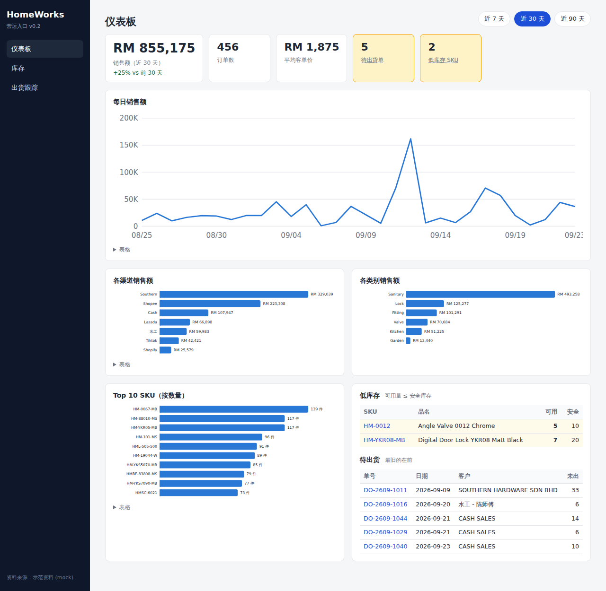
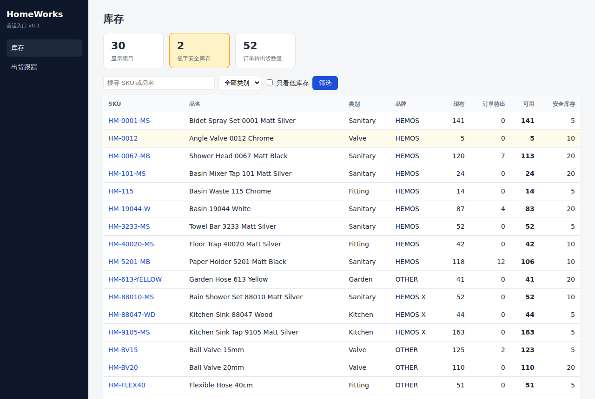
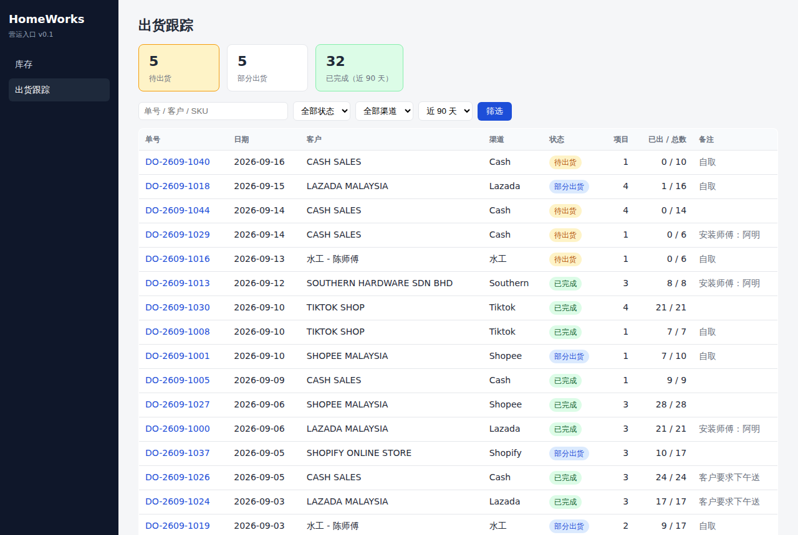
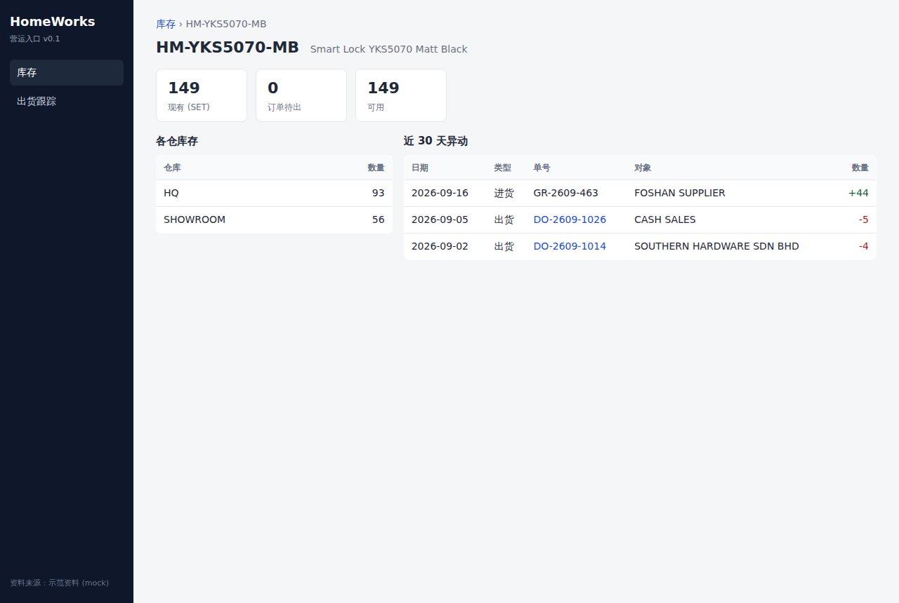
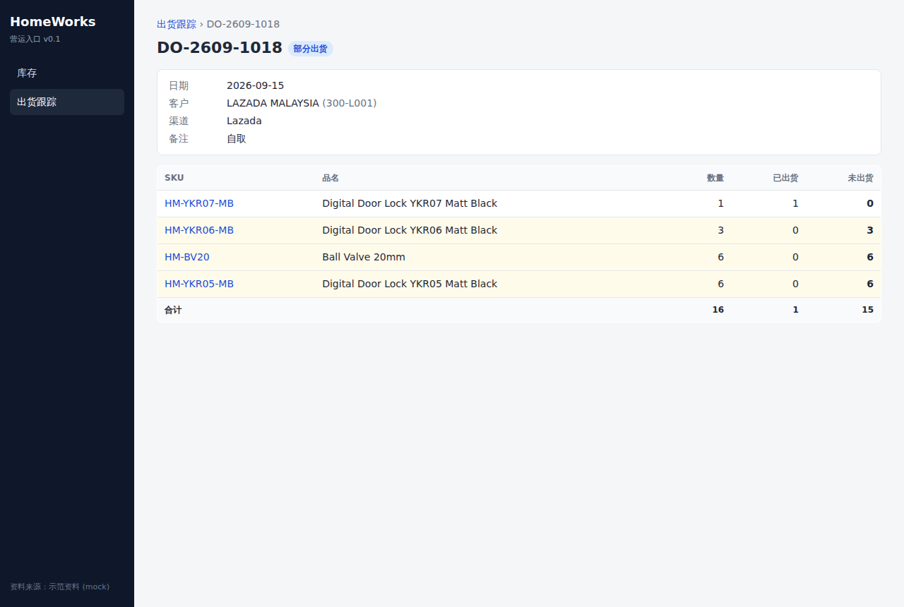

# HomeWorks 营运系统

两个部分，共用同一套 AutoCount 连线与渠道对照：

1. **营运入口（网页）** —— 仪表板、库存、出货跟踪，v0.2，只读
2. **月度电商报表** —— 从 AutoCount 抓数自动产生 Excel 月报

---

# 一、营运入口（网页）

仪表板（销售额与前期比较、各渠道 / 类别、Top 10 SKU、低库存、待出货）、库存查询、各仓库存、近期异动、出货单跟踪。



| 库存 | 出货跟踪 |
|---|---|
|  |  |
|  |  |

## 启动

```bat
pip install -r requirements.txt
run_web.bat
```

浏览器开 `http://localhost:8000`；同网络的其他电脑、手机用这台机器的 IP（例如 `http://192.168.1.20:8000`）。

## 资料来源：两套实作，随时切换

| 来源 | 什么时候用 | 怎么选 |
|---|---|---|
| **示范资料 (mock)** | 开发、测试、展示；任何机器都能跑 | 没有 `autocount.json` 时自动使用，或 `set HW_SOURCE=mock` |
| **AutoCount（只读）** | 正式使用 | 有 `autocount.json` 时自动使用（先跑 `scripts\autocount_setup.py`） |

网页层只认 `webapp/sources/__init__.py` 定义的介面，不直接碰资料库，所以两边行为一致；
示范资料是固定种子产生的，每次内容相同，测试都建立在它上面。

AutoCount 那套的 SQL（`webapp/sources/autocount.py`）已依 discovery 定稿为 AutoCount 2.x 的实际表名
（`IV`/`CS`/`CN`/`DO`/`SO` + `DTL`、`StockDTL`、`Item.ItemBrand`）；仍可在 `autocount.json` 加
`"webapp": {"sql": {...}}` 覆写任何一条，不必改程式。
这个模组只做 SELECT，不会对 AutoCount 写入任何东西。

## 测试

```bat
python -m pytest tests -q
```

## JSON API

`/api/inventory`、`/api/deliveries` 回传与网页相同的资料（给之后的手机版或其他系统用）；`/health` 显示目前接的资料来源。

---

# 二、月度电商报表 / Monthly E-Commerce Report

把每个月要整理的那几张表（Shopee / Lazada SKU 趋势、广告、直播、Top 10、销售汇总）
做成一条可重复执行的流水线：**直接从 AutoCount 抓数 → 自动排版、自动算合计与图表 → 输出 Excel。**

## 每月怎么做

**接上 AutoCount 之后（建议）**——在办公室那台连得到 AutoCount 的电脑上：

```bat
run_monthly.bat
```

抓数 + 产生报表一步到位，也可以交给 Windows 工作排程器每月自动跑，
月报自己出现在 `output/`。设定方式见下一节。

**还没接 AutoCount 时**，也可以手动填数字：

```bash
cp data/_template.json data/2026-09.json     # 1. 复制模板
# 2. 编辑 data/2026-09.json，填入当月数字
python3 scripts/generate_report.py 2026-09   # 3. 生成报表
# → output/月度报表_2026-09.xlsx
```

不带月份参数时，`generate_report.py` 会自动使用 `data/` 内最新的月份。

## 从 AutoCount 自动抓数

报表的数字不必手打 —— `scripts/autocount_extract.py` 会直接连 AutoCount 的
SQL Server 账套，把当月的销售明细汇总成 `data/YYYY-MM.json`，接着
`scripts/generate_report.py` 产生 Excel。

### 你们的情况（已确认）

- AutoCount 装在**办公室本地服务器**上，数据库在内网 → 脚本要装在那台机器上
  （或同内网的任一台电脑），再用 Windows 工作排程器每月自动跑。
- 渠道栏（Shopee / Lazada / Cash / 水工 / Southern / Tiktok / Shopify）靠**不同的
  客户账号（Debtor Code）**分辨 → `channel_rules.mode` 用预设的 `debtor` 即可。
- Shopee / Lazada 订单**逐笔含 SKU 明细**入账 → SKU 月度趋势表与 Top 10
  都能直接从 AutoCount 算出来，不必另外从卖家后台汇出。

### 安装（只做一次）

最简单：**双击 `setup_autocount.bat`**。它会依序装套件、侦测 SQL Server、让你选账套、
探查账套结构，最后用记事本打开 `discovery_*.txt`——把内容贴给 Claude 即可。

手动的话等同于：

```bat
pip install -r requirements.txt
python scripts\autocount_setup.py
python scripts\autocount_discover.py
```

`autocount_setup.py` 会自动侦测这台机器上的 ODBC 驱动、逐一尝试常见的 SQL Server
执行个体（AutoCount 预设是 `A2006`）、列出所有账套让你选，然后把连线资料写进
`autocount.json`。若已知位址，也可以在提示时直接输入（照抄 AutoCount 登入画面上的
Server 名称即可）。

连不上时它会印出实际的错误与该检查什么，不会只丢一个 traceback。

要手动设定的话：`copy autocount.example.json autocount.json` 后自行编辑。
`autocount.json` 内含：

| 项目 | 说明 |
|---|---|
| `connection` | SQL Server 位址、账套（database）、账号密码 |
| `schema` | AutoCount 的表名 / 栏名（各版本略有不同，用下面的探查脚本确认） |
| `channel_rules` | 报表的渠道栏（Shopee / Lazada / Cash / 水工 / Southern / Tiktok / Shopify）在 AutoCount 里怎么分辨 —— 通常是不同的客户账号（Debtor Code） |
| `brand_filter` | 第二张汇总表 (Hemos & Hemos X only) 的品牌筛选条件 |

`autocount.json` 内含密码（用 Windows 验证则没有），已被 `.gitignore` 排除，不会被提交。

### 先确认账套结构

```bat
python scripts\autocount_discover.py
```

会产生 `discovery_<账套名>.txt`，列出销售单据、商品、客户等资料表的栏位与少量
样本。依它的结果修正 `autocount.json` 的 `schema` 段即可。

### 每月执行

最简单：**双击 `make_report.bat`**，输入月份（或直接 Enter = 上个月），它会抓数、产生 Excel、自动打开。

命令列版本：

```bat
run_monthly.bat
```

预设抓「上个月」，抓完直接产生报表。指定月份：`run_monthly.bat 2026-09`。

**全自动**：把 `run_monthly.bat` 加进 Windows 工作排程器，设每月 1 号早上执行，
月报就会自动出现在 `output/`。

先看 SQL 不连数据库：

```bat
python scripts\autocount_extract.py 2026-09 --dry-run
```

### AutoCount 抓得到 / 抓不到什么

| 报表区块 | 来源 |
|---|---|
| Shopee / Lazada SKU 月度销量 | ✅ AutoCount（销售单据明细） |
| Top 10 上升 / 下降 | ✅ AutoCount（当月销量最高 / 最低的十个 SKU） |
| 销售汇总（全品牌 / Hemos） | ✅ AutoCount（类别 × 渠道） |
| Shopee Ads、Lazada Sponsored Affiliate、Shopee AMS | ❌ 在 Shopee / Lazada 卖家后台，不在 AutoCount |
| Live Sales | ❌ 同上 |

广告与直播那两段要自己填进 `data/YYYY-MM.json` 的 `ads` 与 `live_sales`；
抓数脚本**不会覆盖**这两段已填好的内容。

## 报表内容（工作表）

| 工作表 | 内容 |
|---|---|
| 说明 Read me | 报表月份、数据来源、每月更新步骤 |
| Shopee SKU | 指定 SKU 的 Shopee 全年月度销量表 + 折线图 |
| Lazada SKU | 指定 SKU 的 Lazada 全年月度销量表 + 折线图 |
| 广告与直播 | Shopee Ads、Lazada Sponsored Affiliate、Shopee AMS、Live Sales |
| Top 10 | 当月销量上升 / 下降前十 SKU（Lazada、Shopee、合计） |
| 销售汇总-全品牌 | Sales Forecast Summary (All brand) |
| 销售汇总-Hemos | Sales Forecast Summary (Hemos & Hemos X only) |

SKU 趋势表会自动读取 `data/` 内**同一年份的所有月份文件**，所以每加一个月，
Jan–Dec 的表和折线图就自动往前推进一格，不需要手动重打全年数据。

## 文件结构

```
webapp/                        # 营运入口网页（FastAPI）
  main.py                      #   路由
  sources/                     #   资料来源：__init__(介面) / mock(示范) / autocount(只读)
  templates/ static/           #   页面与样式
tests/test_webapp.py           # 网页与资料层的行为测试
run_web.bat                    # 启动网页
docs/screenshots/              # 画面截图
autocount.example.json         # AutoCount 连线与栏位对应设定（复制为 autocount.json）
config.json                    # SKU 清单、渠道栏位、月份名称等设定
run_monthly.bat                # 每月一键（Windows 工作排程器用这个）
scripts/autocount_setup.py     # 自动侦测 SQL Server 与账套，产生 autocount.json
scripts/autocount_discover.py  # 探查 AutoCount 账套结构
scripts/autocount_extract.py   # 从 AutoCount 抓当月数据 → data/YYYY-MM.json
scripts/generate_report.py     # data/YYYY-MM.json → Excel 报表
scripts/run_monthly.py         # 抓数 + 产报表
data/_template.json            # 手动填数据时的模板
data/2026-01.json … 08.json    # 各月数据（2026-08 为完整示范）
output/月度报表_2026-08.xlsx    # 产出
```

## 设定 `config.json`

- `sku_trend_list`：趋势表要追踪的 SKU（增减 SKU 改这里，两张趋势表同步）
- `forecast_channels`：销售汇总的渠道栏（`key` 是 JSON 里用的键，`header` 是表头）
- `live_sales_channels`：Live Sales 的渠道
- `year` / `months`：年份与月份表头

## 数据填写规则

- 金额单位一律 **RM**；没有的渠道直接省略该键，表格显示空白。
- **合计、百分比、平均单价都是 Excel 公式**（`SUM`、`Total ÷ 合计`、`Total ÷ QTY`），
  在 Excel 里改动明细数字会自动重算，不必重跑脚本。
- 广告的 `%` = `ADS EXPENSE ÷ ADS GMV`，自动计算。
- Top 10 的 `TOTAL (QTY)` = `LAZADA + SHOPEE`，自动计算。
- 数值 0 或未填写显示为空白；月度 TOTAL 行的 0 会照常显示（与原报表一致）。

## 环境需求

```bash
pip install openpyxl        # 产生报表
pip install pyodbc          # 连 AutoCount 才需要
```

连 AutoCount 还需要 Microsoft 的 **ODBC Driver 17 for SQL Server**（Windows 上多半已随
SQL Server 装好；没有的话到微软官网下载）。

## 数据出处

`data/2026-01.json` … `data/2026-08.json` 的数字，来自用户提供的 2026 年 8 月纸本报表
（Shopee / Lazada SKU 月度表、Shopee Ads、Lazada Sponsored Affiliate、Shopee AMS、
Live Sales、Top 10 Up/Down、Sales Forecast Summary 两张表）。
2026-01 至 2026-07 只含 SKU 月度销量（纸本上只有这部分历史数据）。

## 待核对的一笔数字

`SHOPEE ADS` 四周的 ADS EXPENSE 加总为 **36,064.50**，但纸本 TOTAL 印的是 **36,064.70**，
相差 0.20 —— 推测是 `9~15` 那周应为 `8812.90` 而不是 `8812.70`（纸本该处不易辨认）。
请核对后修改 `data/2026-08.json`，报表的 TOTAL 是公式会自动更新。
除此之外，两张销售汇总的所有渠道合计、QTY、SKU 各月合计、Lazada 广告合计，
都与纸本报表**完全一致**。
